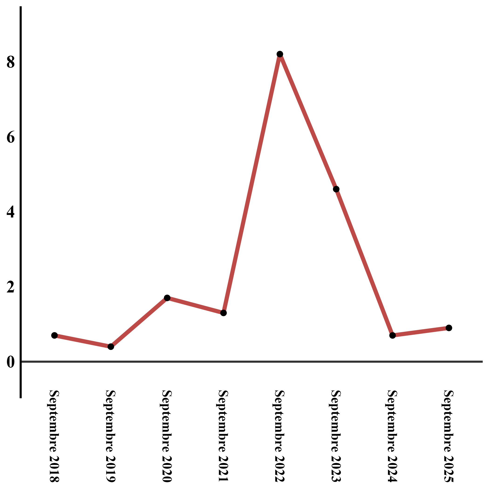
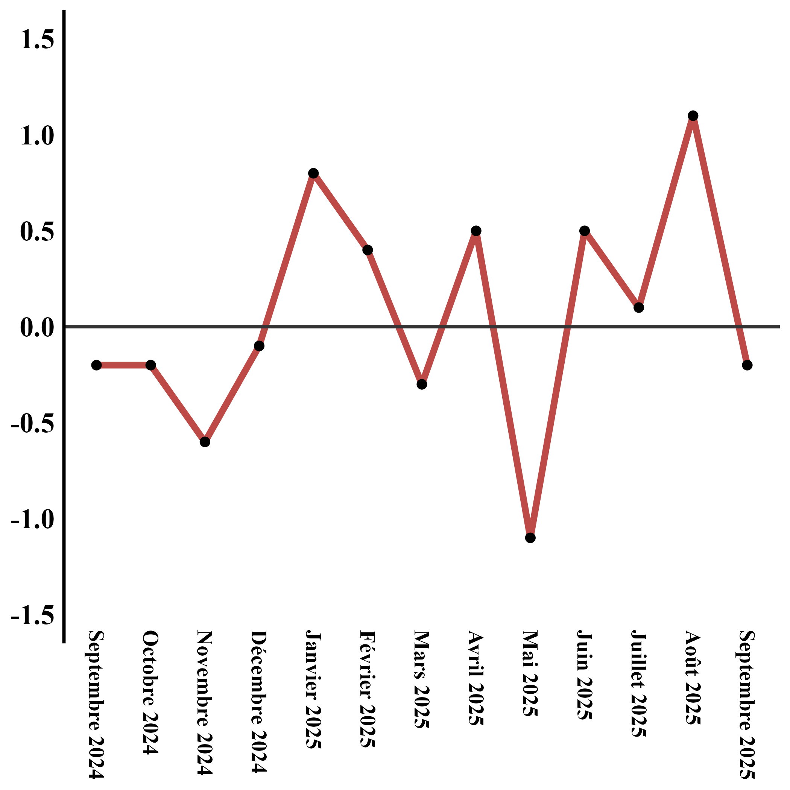
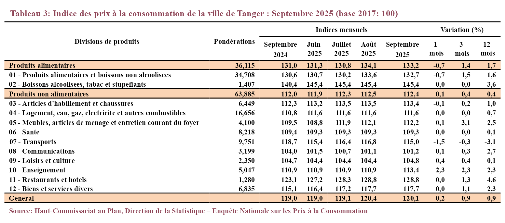

```{r}
#| label: initialisation
#| echo: false 
#| warning: false 
#| message: false 
 
# Packages 
library(dplyr)
library(lubridate)
library(kableExtra) 
library(ggplot2) 
library(tidyr)
library(glue)
library(stringr)
library(janitor)

# option 
# pour empêcher quarto d'appliquer automatiquement son propre style, alignement, pagination, etc.)
options(knitr.table.html.attr = "quarto-disable-processing=true") 

```

```{r}
#| label: parametres
#| echo: false
#| warning: false 
#| message: false 
# Recuperation des parametres
code_ville <- str_pad(params$p_ville, width = 2, pad = "0")
periode_analyse <- params$p_periode 
langue <- params$p_langue
```

```{r}
#| label: preparation_donnees
#| echo: false 
#| warning: false 
#| message: false 

# Sous-programme de préparation – traitement des donnees
source(file="ZZ_Preparation_donnees_word.R")

# Appeler la fonction
resultat <- retrouver_donnees(periode_analyse,code_ville,langue)
```

```{=openxml}
<w:sectPr>
<w:pgSz w:w="11906" w:h="16838"/> <!-- A4 en twips -->
  <w:pgMar 
    w:top="800"
    w:bottom="800"
    w:left="992"
    w:right="992"
    w:header="708"
    w:footer="708"
    w:gutter="0"/>
</w:sectPr>
```
::: {custom-style="entete_ville"}
Indice des prix à la consommation - `r resultat$lib_mois_annee_m`       `r toupper(resultat$ville)`
:::

::: {custom-style="chapo"}
`r resultat$phrase01` `r resultat$phrase02`
:::

```{=openxml}
<w:sectPr>
<w:pgSz w:w="11906" w:h="16838"/> <!-- A4 en twips -->
  <w:pgMar 
    w:top="800"
    w:bottom="800"
    w:left="992"
    w:right="992"
    w:header="708"
    w:footer="708"
    w:gutter="0"/>
</w:sectPr>
```
```{=openxml}
<w:p>
  <w:pPr>
    <w:sectPr>
      <!-- Section à 1 colonne -->
      <w:type w:val="continuous"/>
      <w:cols w:num="1" w:space="820"/>
    </w:sectPr>
  </w:pPr>
</w:p>
```
::: {custom-style="ligne_separation"}
**Sur un mois** `r resultat$phrase03`
:::

::: {custom-style="texte"}
`r resultat$phrase04`
:::

::: {custom-style="texte"}
**Sur un an** `r resultat$phrase05`
:::

::: {custom-style="texte"}
`r resultat$phrase06`
:::

::: {custom-style="titre_illustration"}
1-Évolution du taux de la variation annuelle (%) de l’indice des prix à la consommation pour le mois d’Août
:::

::: {custom-style="texte"}
{width="7.9cm" height="6cm"}
:::

::: {custom-style="note_lecture"}
Lecture : En Août 2025, l'indice des prix à la consommation a décru de 0,5% par rapport à Août 2024
:::

::: {custom-style="titre_illustration"}
2- Évolution de la variation mensuelle (%) de l’indice des prix à la consommation
:::

::: {custom-style="texte"}
{width="7.9cm" height="5cm"}
:::

::: {custom-style="note_lecture"}
Lecture : La variation des prix en Août 2025 a augmenté de 2,2% Après avoir été de 0,4% en Juillet 2025
:::

```{=openxml}
<w:p>
  <w:pPr>  
      <w:sectPr>
      <w:pgSz w:w="11906" w:h="16838"/> <!-- A4 en twips -->
        <!-- Début de la section à 2 colonnes -->
        <w:type w:val="continuous"/>
        <!-- marges identiques à la section précédente -->
      <w:pgMar 
        w:top="800"
        w:bottom="800"
        w:left="992"
        w:right="992"
        w:header="708"
        w:footer="708"
        w:gutter="0"/>
        <w:cols w:num="2" w:space="820"/>
      </w:sectPr>
  </w:pPr>
</w:p>
```
::: {custom-style="texte"}
{width="18cm"}
:::

```{=openxml}
<w:pPr>
  <w:sectPr>
    <w:type w:val="continuous"/>
    <w:cols w:num="2" w:space="820"/>
  </w:sectPr>
</w:pPr>
```
